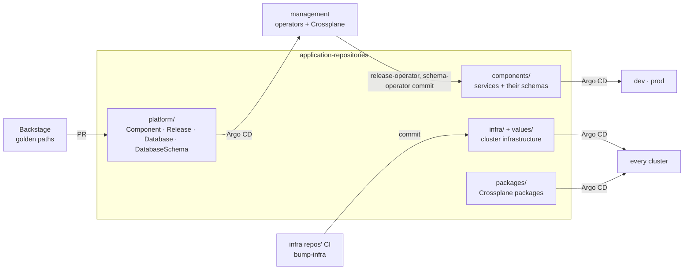

# application-repositories

The platform's record of **what runs where**. Every service, every piece of
cluster infrastructure, every platform API package and every platform request
(`Component`, `Release`, `Database`) is a small file here. Argo CD reads the
files directly, so a pull request against this repo is the whole onboarding or
deployment step.

- **One file per thing per environment.** The path names it
  (`<kind>/<name>/<env>.yaml`), and the environment selects the cluster.
- **Every change is a commit.** People, Backstage, the operators and CI all
  change the platform by committing here. Only Argo CD applies anything.
- **Each file has one kind of writer**, so automation never overwrites a human
  decision (see [Who writes what](#who-writes-what)).

## Where it fits



Each top-level directory is read by one ApplicationSet in
[argocd](https://github.com/entr0pian/argocd).

| Directory | ApplicationSet | Holds |
|---|---|---|
| `platform/` | `taskapp-platform` | `Component`, `Release`, `Database` and `DatabaseSchema` resources, applied as-is to `management` |
| `components/` | `taskapp-catalog`, `taskapp-schemas` | Where each service's chart comes from, and its values, per environment (`environments/`, `values/`); which schema package each environment's database gets (`schema/`) |
| `infra/` + `values/` | `taskapp-infra` | Cluster infrastructure: ingress, DNS, certificates, External Secrets, Prometheus, Mimir, Crossplane, Backstage, the operators… |
| `packages/` | `taskapp-packages` | Which version of a Crossplane package runs in each environment |

The platform's clusters are rebuilt daily. Before a teardown, the
`components/` and `platform/` files are removed, so those directories are often
empty on `main`.

## A service, end to end

Onboarding `payments` through Backstage adds two files to `platform/`:

```yaml
# platform/registry/payments.yaml: identity, one per component
apiVersion: platform.taskapp.io/v1alpha1
kind: Component
metadata:
  name: payments
spec:
  owner: payments-team
  repository: {name: payments, visibility: public}
  scaffold: {template: golang-service, version: "0.12.0"}
---
# platform/environments/dev/payments-release.yaml: what runs in dev
apiVersion: platform.taskapp.io/v1alpha1
kind: Release
metadata:
  name: payments-dev
spec:
  componentRef: {name: payments}
  environment: dev
  autoDeploy: {branch: main}   # follow green builds of main
```

The `Component` creates and scaffolds the repository. Once the first CI build is
green, [release-operator](https://github.com/entr0pian/release-operator)
writes the deployment files, pinning chart and image to the same commit:

```yaml
# components/payments/environments/dev.yaml
component: payments
environment: dev
namespace: dev
source:
  repoURL: https://github.com/entr0pian/payments.git
  targetRevision: f091434…
  chartPath: chart
---
# components/payments/values/dev.yaml
image:
  tag: f091434…
```

A `Database` in `platform/environments/<env>/` provisions RDS through
[crossplane-compositions](https://github.com/entr0pian/crossplane-compositions).
A `Release` that binds it adds the credentials' Secrets Manager path to the
values file, never the credentials themselves.

The database's schema is released on its own, separately from the code. A
`DatabaseSchema` in the same directory names the commit of the service's
repository whose `migrations/` the database should have:

```yaml
# platform/environments/dev/payments-db-schema.yaml
apiVersion: platform.taskapp.io/v1alpha1
kind: DatabaseSchema
metadata:
  name: payments
  namespace: dev
spec:
  componentRef: {name: payments}
  version: 3f9c2e1…        # full commit SHA
```

Once the service's CI has published that commit's schema package,
[schema-operator](https://github.com/entr0pian/schema-operator) writes the
pointer, and `taskapp-schemas` deploys the package, whose `AtlasMigration`
applies the new migrations:

```yaml
# components/payments/schema/dev.yaml
chart: schema
commit: 3f9c2e1…
component: payments
database: {name: payments-db, remoteRef: /bindings/dev/databases/payments-db}
environment: dev
namespace: dev
repoURL: ghcr.io/entr0pian/payments
version: 0.0.0-g3f9c2e1…
```

## Who writes what

| Files | Written by | How |
|---|---|---|
| `platform/registry/`, `platform/environments/` | People, through Backstage templates | Pull request opened by the portal's GitHub App, reviewed and merged by a person |
| `Release` `version` (auto-deploy, dev only) | release-operator | Direct commit, forward only, never over a concurrent human change |
| `components/<c>/environments/`, `values/` | release-operator only | Derived from the `Release`. Nobody edits these by hand |
| `components/<c>/schema/` | schema-operator only | Derived from the `DatabaseSchema`. Nobody edits these by hand |
| `infra/<c>/<env>.yaml` `targetRevision` + `values/<c>/<env>.yaml` image tag | The component's own CI, via `bump-infra.yml` | Direct commit as `taskapp-platform-deployer[bot]` after a green build on `main` |
| Everything else in `infra/`, `values/`, `packages/` | People | Pull request |

`.github/workflows/bump-infra.yml` is a reusable workflow. The platform's own
components (the four operators and Backstage) call it after a green build, so
the platform ships through the same GitOps path it gives services. It needs no
stored secret: the caller's GitHub OIDC token assumes an AWS role that can read
only the GitHub App key, and only when called from an infra repo's `main`.

## File shapes

**`infra/<name>/<env>.yaml` + `values/<name>/<env>.yaml`.** An identity file
(chart source, namespace, sync wave, Slack `notify`) merged with a values file
holding the Helm values as one string. Use `chart` for a Helm repository or
`chartPath` for a Git repository, and leave the other `""`.

```yaml
# infra/backstage/management.yaml
name: backstage-management
repoURL: https://github.com/entr0pian/backstage.git
chart: ""
chartPath: chart
targetRevision: "acb24cb…"
namespace: backstage
createNamespace: true
serverSideApply: true
wave: "3"
notify: true
values: ""
```

**`packages/<pkg>/<env>.yaml`.** The installer chart plus the OCI package
version. Promoting a package is a one-line `version` change. Publishing a new
version never deploys it by itself.

```yaml
# packages/crossplane-compositions/management.yaml
name: crossplane-compositions-management
environment: management
source:
  repoURL: https://github.com/entr0pian/crossplane-compositions.git
  targetRevision: main
  path: charts/configuration-installer
package:
  repository: ghcr.io/entr0pian/crossplane-compositions
  version: v0.4.6          # always an explicit tag, never latest
values:
  pullPolicy: IfNotPresent
```

## Design choices

- **Identity separate from values.** Where a chart comes from rarely changes and
  deserves review. Image tags change on every deploy. Keeping them in separate
  files keeps automated writers away from the identity side.
- **Intent separate from deployment state.** `platform/` holds what people ask
  for, and `components/` holds what the operator derived from it. Changing
  what runs means changing the `Release`, never the derived files.
- **Clusters by label, never by URL.** A file names an environment, and Argo CD
  resolves it to whichever registered cluster carries that `environment`
  label. No cluster URL appears anywhere in this repo.
- **Platform resources aren't Helm releases.** `platform/` files are real
  Kubernetes resources applied verbatim, one Application each, so each
  `Release` or `Database` has its own sync and health status.
